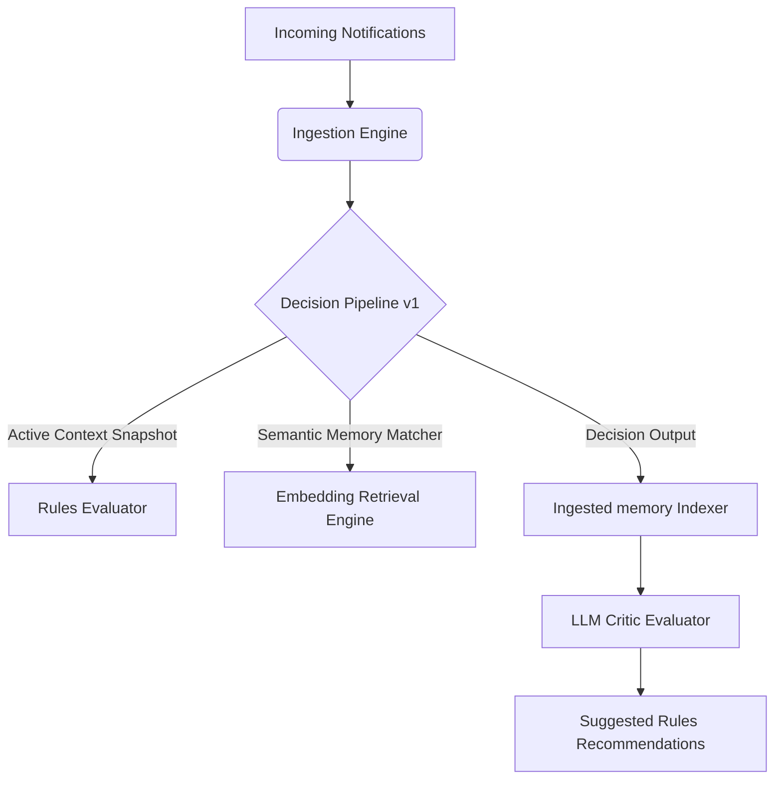

# InterruptIQ — Attention Gateway & Cognitive Optimizer (v1.0.0)

InterruptIQ is an intelligent, context-aware cognitive attention gateway. Rather than acting as a static notification blocker, it operates as a context-aware gateway calculating real-time cognitive budgets, delivery options, and notification categories.

---

## 🚀 Key Features

* **Real-time Context Tracking:** Continuously aggregates system, activity, focus, and battery signals.
* **Deterministic Rules Engine:** Executes priority classification and context threshold matching.
* **Semantic Retrieval Engine:** Connects historical decisions to direct local embedding matches (BGE-small-en-v1.5).
* **LLM Critic review**: Headless critic evaluating decisions against historical memory records and user overrides.
* **Web Simulator Dashboard**: Real-time developer control panel to customize context, inject events, and inspect outputs.

---

## 🏛️ Architecture Overview

The system is split into three main components:
1. **API Monolith Gateway:** Powered by Fastify, Zod, and PostgreSQL/Prisma.
2. **Local Embedding Engine:** Powered by ONNX Runtime / Transformers.js to execute local embeddings calculations offline.
3. **AI Simulator Dashboard:** Powered by React, Vite, and TailwindCSS.



---

## 📂 Folder Structure

```
├── apps
│   ├── api          # Fastify TypeScript service
│   └── web          # React simulator application
├── packages
│   ├── embedding-engine # Local vector embedding generator (ONNX)
│   ├── ai-core      # Rules definitions
│   ├── shared       # Shared types and constants
│   └── ui           # UI components
├── docs             # System design specifications
└── docker-compose.yml
```

---

## 🛠️ Tech Stack
* **Backend:** Node.js, Fastify, TypeScript, Prisma, Vitest.
* **Database:** PostgreSQL.
* **Embeddings:** ONNX Runtime, Transformers.js (MiniLM / BGE-small).
* **Frontend:** React, Vite, TailwindCSS, Zustand, Framer Motion.

---

## ⚙️ Environment Setup & Installation

Clone the repository and install all workspace dependencies:
```bash
pnpm install
```

Configure your environment variables by copying `.env.example` to `.env`:
```bash
cp .env.example .env
```

Apply database migrations:
```bash
pnpm --filter @interrupt-iq/api prisma db push
```

---

## 💻 Running Locally

### Development Mode
```bash
pnpm run dev
```

### Production Mode
```bash
pnpm run build
pnpm start
```

### Running Test Suites
```bash
pnpm run test
```

---

## 🐳 Docker Setup

Build and launch the complete stack containing Postgres, API, and Web client:
```bash
docker-compose up --build
```

For production environments, stack overrides can be run via:
```bash
docker-compose -f docker-compose.yml -f docker-compose.prod.yml up -d
```

---

## 💾 Database Migrations Setup

Apply database migrations:
```bash
pnpm --filter @interrupt-iq/api prisma migrate deploy
```

---

## 🏛️ Module Overview & Subsystems

* **`apps/api`**: Fastify framework hosting context snapshots, event ingestion pipelines, decision history, and critic evaluations endpoints.
* **`apps/web`**: React, Vite, Tailwind CSS interface providing operator control sliders, telemetry views, and feedback panels.
* **`packages/embedding-engine`**: Local vector space calculator hosting transformers ONNX engines with memory-safe LRU eviction limits.

---

## 🛠️ Development Workflow

1. **Spin up local database**:
   ```bash
   docker-compose up -d postgres
   ```
2. **Execute type checking**:
   ```bash
   pnpm run typecheck
   ```
3. **Execute test runners**:
   ```bash
   pnpm run test
   ```

---

## 🚀 Deployment Guide

1. **Configure Production env**: Copy `.env.example` to production `.env` and override:
   - `DATABASE_URL` pointing to production cluster.
   - `JWT_SECRET` configured with secure cryptograph hashes.
   - `ALLOWED_ORIGINS` locked down to client hosts.
2. **Launch via compose**:
   ```bash
   docker-compose -f docker-compose.yml -f docker-compose.prod.yml up -d --build
   ```

---

## 📦 Migration Guide

To introduce database model changes:
1. Update models in `apps/api/prisma/schema.prisma`.
2. Generate migration SQL file (non-interactive):
   ```bash
   npx prisma migrate diff --from-empty --to-schema-datamodel prisma/schema.prisma --script > prisma/migrations/<timestamp>_<name>/migration.sql
   ```
3. Mark migration as applied in development:
   ```bash
   npx prisma migrate resolve --applied <timestamp>_<name>
   ```
4. Deploy migrations in production pipelines:
   ```bash
   npx prisma migrate deploy
   ```

---

## 📖 API Documentation Reference
Once the backend starts, Swagger interactive documentation is exposed at:
* **Interactive spec:** [http://localhost:3001/documentation](http://localhost:3001/documentation)

---

## 🗺️ Project Roadmap
* **v1.1.0:** Real-time push notification adapters (Slack / Email webhooks).
* **v1.2.0:** Multi-agent LLM selector and local LLM fine-tuning loops.
* **v2.0.0:** On-device context aggregation and native iOS/Android clients.
