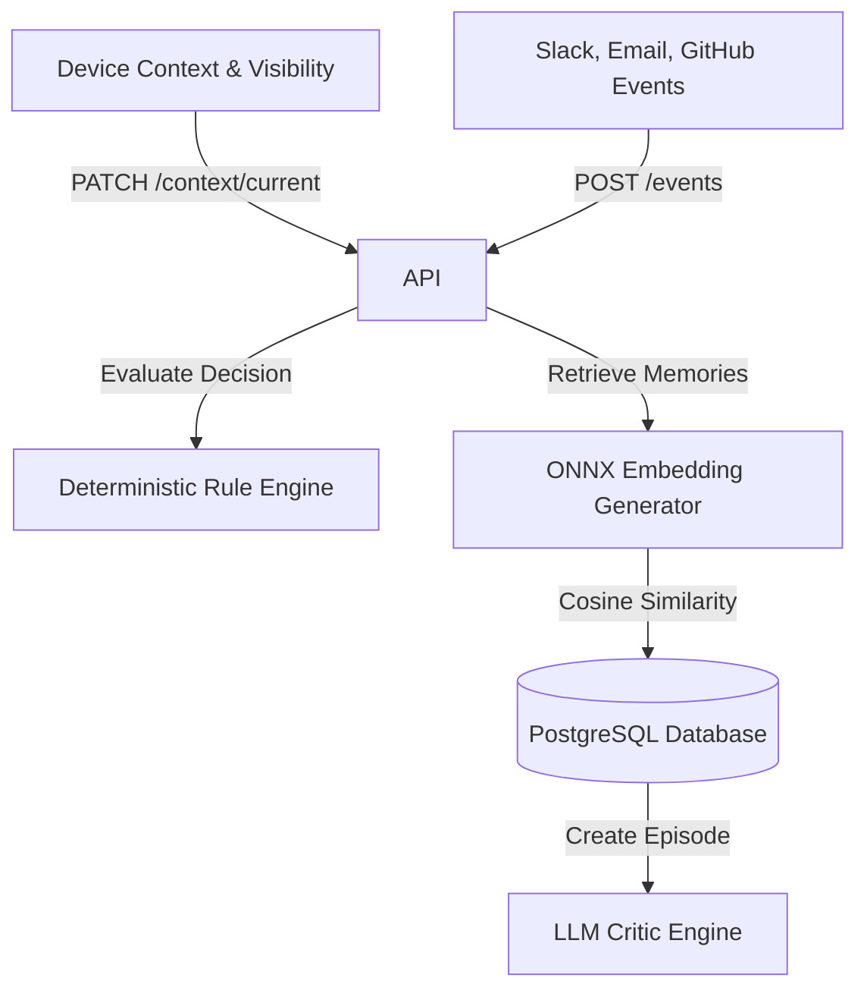

# InterruptIQ System Architecture

This document details the architectural decisions and modules in InterruptIQ.

## System Topology

## Module Definitions

### 1. Ingestion Engine (`apps/api/src/modules/events`)
Responsible for receiving and validating notification events. Future-proofed to accept custom payload objects and metadata maps.

### 2. Context Tracker (`apps/api/src/modules/context`)
Tracks battery, focus levels, working modes, visible status, and network configurations.

### 3. Decision Pipeline (`apps/api/src/modules/decision`)
Calculates priority, checks rule matches, and outputs delivery action verdicts (IMMEDIATE, BATCH, IGNORE).

### 4. Memory Indexer (`apps/api/src/modules/memory`)
Indexes decisions into immutable episodes, calling the `@interrupt-iq/embedding-engine` to build cosine vector attributes.

### 5. Semantic Retrieval Engine (`apps/api/src/modules/retrieval`)
Queries context database for similar episodes using a hybrid scoring algorithm blending text metadata and vector embedding similarity.

### 6. LLM Critic Engine (`apps/api/src/modules/critic`)
Generates prompts compiling context overrides and issues verdict recommendations using OpenAI, Ollama, or Mock providers.
