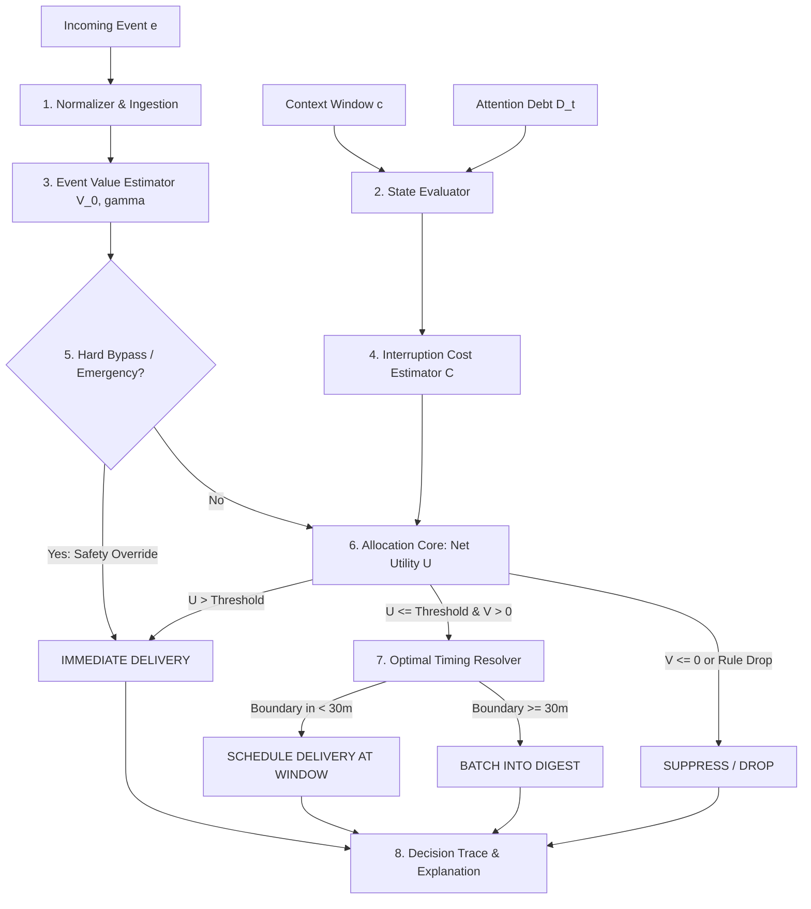

# InterruptIQ Attention Engine

> **Architecture Specification & Product Primitive Document**  
> **Status:** Maintainer Proposal & Technical Blueprint  
> **Author:** InterruptIQ Core Architecture Team  
> **Date:** September 2026  

---

## 1. Product Thesis

Human attention in knowledge work is **synchronous, finite, and highly fragile**. Modern software events (Slack mentions, GitHub reviews, Jira tickets, monitoring alerts, email threads) arrive **asynchronously, continuously, and indiscriminately**.

Every existing notification tool attempts to answer an event-centric question:
> *"Does this incoming event meet a threshold of importance to ring, banner, or ping?"*

This question is fundamentally broken because it ignores the recipient's cognitive state. An event with high objective value (e.g., a critical pull request review requested by a peer) delivered during a state of deep conceptual focus (e.g., debugging a race condition) destroys cognitive flow, generating an attention residue penalty that costs 15 to 25 minutes to recover. Conversely, that exact same event delivered during a natural cognitive boundary (between meetings, concluding a task, or during administrative triage) costs virtually zero focus.

### The InterruptIQ Thesis
**InterruptIQ is an attention allocation engine that models the cognitive cost and informational value of interruptions over time to determine whether, when, and how a software event should consume human attention.**

InterruptIQ shifts the paradigm from **Event-Centric Filtering** to **Attention-Centric Allocation**:
```
Event-Centric (Old Paradigm):
Event ──────────────────────────► Filter (Is it spam?) ──► Notify Now

Attention-Centric (InterruptIQ):
Event ──► [Event Value] ┐
                        ├─► Allocation Engine ──► IMMEDIATE / DELAY TO WINDOW / BATCH / SUPPRESS
Context ─► [Interrupt Cost] ┘       ▲
                                    │
Attention State (Debt + Budget) ────┘
```

---

## 2. Problem We Are Actually Solving

### 2.1 The Attention Fragmentation Epidemic
- **Attention Residue:** When an individual switches from Task A to Task B (even for a 10-second notification), a significant fraction of cognitive bandwidth remains stuck on Task A. If interrupted repeatedly, workers exist in a permanent state of reduced cognitive capacity.
- **The False Urgency Trap:** Communication platforms conflate *sender urgency* with *recipient value*. A teammate asking "Got a minute?" on Slack is optimized for the sender's convenience, externalizing the interruption cost onto the recipient.
- **Binary Failure Mode:** Today's operating systems offer only two blunt extremes:
  1. *Open Door (Normal Mode):* Every ping interrupts. Attention is shredded.
  2. *Blast Wall (Do Not Disturb):* All notifications are silenced. Critical system outages and true emergencies are missed, inducing anxiety that forces workers to manually poll their inboxes.

### 2.2 What Needs to Exist
An intelligent, ambient mediator that sits between all incoming event streams and the human attention interface. It understands the recipient's active task, recent cognitive load, personal interruption tolerance, and the genuine half-life of incoming signals, allowing true emergencies to cut through instantly while buffering everything else into optimal delivery windows.

---

## 3. Existing Product Landscape

| Product / Category | Core Mechanism | Overlap with InterruptIQ | Fundamental Limitation / Difference |
| :--- | :--- | :--- | :--- |
| **Apple / Android Focus Modes** | Schedule-based or location-based binary silence; allowed sender whitelists. | Contextual silencing based on preset schedules. | Static, blunt, and non-adaptive. Cannot inspect event semantics or measure real-time task complexity. |
| **Slack AI / Apple Intelligence Summaries** | LLM summarization of buffered notification text into bullet points. | Cleans up notification text volume. | **A summarizer is not an allocator.** Condensing 20 interruptions into 20 summarized banners still interrupts the human. |
| **Superhuman / Shortwave** | AI email triage, split inboxes, urgency scoring, automated draft generation. | Classifies importance based on sender relationships. | Confined entirely to email clients. Does not model real-time cognitive state, calendar load, or cross-platform events. |
| **Opal / Freedom / Forest** | Hard network and app blockers based on Pomodoro timers or session clocks. | Protects focus time from voluntary self-distraction. | Defensive against *user-initiated* distraction, but cannot arbitrate *incoming external* operational events (e.g., Slack/PagerDuty). |
| **PagerDuty Event Orchestration** | Noise reduction, deduplication, alert suppression rules for infrastructure events. | Evaluates incoming events and drops duplicates. | Built for machine infrastructure, not human cognitive budgets. Has zero awareness of human focus states or calendar boundaries. |
| **Laya / Notion Agent** | Executive assistants that synthesize messages, draft responses, and manage schedules. | Cross-platform context awareness. | Operates as a conversational agent or executive proxy, rather than a deterministic real-time attention gatekeeper. |

### The Defensible Gap
**No existing platform models the dynamic economic trade-off between the marginal informational gain of an event and the immediate cognitive damage of an interruption.**

---

## 4. What InterruptIQ Should NOT Become

To maintain product focus and technical integrity, InterruptIQ explicitly rejects the following product identities:

1. **NOT an AI Notification Summarizer:** Summarization is a presentation feature, not a decision engine. Merely rewording a distraction does not protect flow state.
2. **NOT a Unified Inbox / Messaging Client:** InterruptIQ is not an app where users read their Slack messages, emails, and GitHub PRs. InterruptIQ is a **headless gateway** that intercepts and routes signals to existing user interfaces.
3. **NOT a Conversational Chatbot:** Users should not have to chat with an assistant to ask "What should I pay attention to right now?". The allocation engine works silently and ambiently.
4. **NOT an Employee Surveillance Tool:** We explicitly reject keystroke logging, screen recording, webcam gaze tracking, or manager productivity scoring. All attention models are client-focused, private to the individual, and explainable.
5. **NOT a High-Latency LLM Wrapper:** We do not execute a 3-second LLM API call on every incoming webhook. Decisions must be fast (<20ms for rule/heuristic evaluation), robust, and mathematically grounded, utilizing LLMs only asynchronously for deep critic reviews and pattern extraction.

---

## 5. Core Primitive

The core mathematical and product primitive of InterruptIQ is:

$$\text{Net Interruption Utility } U(e, u, c, t) = V(e, t) - C(e, u, c, t)$$

Where:
- **$V(e, t)$** is the **Event Value** at time $t$ (informational utility, blast radius, and time-decay penalty if delayed).
- **$C(e, u, c, t)$** is the **Interruption Cost** (cognitive disruption penalty determined by the user's Context State $c$, Attention Debt $d$, and Attention Profile $u$).

### Decision Rule:
- If $U(e, u, c, t) > \tau_{\text{immediate}}$: **IMMEDIATE** (Notify now; the cost of delaying exceeds the disruption cost).
- If $U(e, u, c, t) \le \tau_{\text{immediate}}$ and $V(e, t_{\text{window}}) > \tau_{\text{relevant}}$: **DELAY** (Schedule delivery at optimal transition boundary $t_{\text{window}}$).
- If $V(e, t) < \tau_{\text{batch}}$: **BATCH** (Hold for daily/periodic digest).
- If $V(e, t) \le 0$ or matches strict silencing rules: **SUPPRESS** (Drop or log silently without user notification).

```
                 Event Value V(e,t)
                         ▲
                         │
     [DELAY / SCHEDULE]  │    [IMMEDIATE]
     High Value,         │    High Value,
     High Cost           │    Low Cost
                         │
 ────────────────────────┼────────────────────────► Interruption Cost C(e,u,c,t)
                         │
     [SUPPRESS / DROP]   │    [BATCH]
     Low Value,          │    Moderate Value,
     High Cost           │    Low Cost
                         │
```

---

## 6. Attention Budget

### 6.1 Critical Analysis of "Budget"
In the current repository, `README.md` claims InterruptIQ computes "real-time cognitive budgets," yet **zero code or models exist** to implement this.

A simplistic model might declare `attentionBudget = 100` and deduct 10 points per notification. **This is rejected as a toy abstraction.** Human cognitive capacity does not behave like a debit card. A person does not have "73 attention points" remaining.

### 6.2 The Defensible Abstraction: Interruption Capacity Window ($B_t$)
Instead of a static number, Attention Budget is modeled as **Instantaneous Interruption Capacity** $B_t \in [0.0, 1.0]$:
- $B_t = 1.0$: Fully available. The user is in an open, low-demand state (idle, transition between tasks, administrative triage). Threshold for interruption is low.
- $B_t = 0.0$: Saturated capacity. The user is in maximum deep focus, an active production incident, or presentation mode. Threshold for interruption is near-infinite (only existential emergencies break through).

### 6.3 Inputs & Signals

#### Currently Available in Repository (`ContextSnapshot`):
- `battery` (Int) & `charging` (Boolean): Device power state.
- `network` (String: online/offline): Physical connectivity.
- `activity` (String: coding, meeting, idle, sleeping).
- `focusLevel` (Int: 0-100): Manually or externally set focus score.
- `workingMode` (String: deep-work, meeting, shallow-work, etc.).
- `calendarStatus` (String: focused, busy, free).
- `currentTask` (String: text description of active focus).

#### Future Signals (Required for Full Fidelity):
- Calendar schedule proximity (minutes remaining in current focus block).
- IDE activity state (active file typing vs browsing).
- Audio/microphone status (in a call vs muted listening).
- Diurnal chronotype model (morning focus peaks vs afternoon administrative dips).

---

## 7. Attention Debt

### 7.1 What Attention Debt Actually Is
Attention Debt models the **cumulative cognitive fatigue and attention residue** generated by successive interruptions.

When an individual is interrupted, their focus does not immediately snap back to 100% when the notification is dismissed. Research in cognitive psychology demonstrates that attention residue decays asymptotically over a 15–25 minute half-life. If a second interruption arrives 3 minutes after the first, the cognitive cost is not additive—it is **super-linear**.

```
Single Interruption:
Focus 100% ────┐
               └──\____ Recovery (15-20 min) ____/────► 100%

Compound Interruptions (Attention Debt):
Focus 100% ──┐      ┌──┐      ┌──┐
             └───\──┘  └───\──┘  └───────────────────► Cognitive Collapse (Debt Saturated)
```

### 7.2 Attention Debt vs. Simple Rate Limiting

| Feature | Standard Rate Limiter (e.g., Leaky Bucket) | Attention Debt Engine |
| :--- | :--- | :--- |
| **Object Tracked** | Count of HTTP requests or notifications per hour. | Biological attention recovery state. |
| **Event Sensitivity** | 5 Slack messages = 5 units deducted. | A routine Slack ping deducts 5 units; an urgent PR review during deep work deducts 25 units. |
| **Context Awareness** | Unaware of whether user is asleep, coding, or idle. | Debt accumulation scales with current task complexity. |
| **Decay Dynamics** | Constant tick rate (e.g., +1 token every 60s). | Exponential half-life decay dependent on uninterrupted continuous focus time. |

### 7.3 Mathematical Dynamics of Attention Debt $D(t)$
Let $D(t) \ge 0$ represent the user's instantaneous Attention Debt:

1. **Accumulation on Interruption $i$:**
   $$D(t^+) = D(t^-) + \Delta D_i$$
   Where $\Delta D_i = \kappa \cdot (1 + \text{FocusLevel}) \cdot \text{Cost}(e_i)$
2. **Exponential Recovery during Uninterrupted Work:**
   $$D(t) = D(t_0) \cdot e^{-\lambda (t - t_0)}$$
   Where $\lambda$ is the recovery rate constant (typically calibrated to a 20-minute half-life, $\lambda \approx \frac{\ln 2}{1200\text{ s}}$).
3. **Debt Penalty on Interruption Cost:**
   As $D(t)$ increases, the barrier for subsequent immediate interruptions rises:
   $$C(e, u, c, t) = C_{\text{base}}(e, c) \cdot (1 + \beta \cdot D(t))$$

---

## 8. Interruption Cost

### 8.1 Definition
**Interruption Cost** $C(e, u, c, t)$ is the quantified cognitive loss inflicted on the user if interrupted by event $e$ at time $t$.

### 8.2 Deterministic Cost Computation
To ensure predictable sub-millisecond evaluation, Interruption Cost must **not** require an LLM call per event. It is computed via a multi-dimensional matrix:

$$C(e, u, c, t) = W_{\text{mode}} \cdot \left[ \alpha_1 F_{\text{focus}} + \alpha_2 S_{\text{switch}} + \alpha_3 M_{\text{meeting}} \right] \cdot (1 + \beta D(t))$$

1. **Working Mode Multiplier ($W_{\text{mode}}$):**
   - `deep-work`: $1.8 \times$
   - `coding`: $1.5 \times$
   - `meeting`: $2.0 \times$ (interrupting a meeting has high social and attention cost)
   - `administrative` / `shallow-work`: $0.8 \times$
   - `idle`: $0.3 \times$
2. **Focus Level Penalty ($F_{\text{focus}}$):** Direct scalar from context ($0.0 - 1.0$).
3. **Context Switch Distance ($S_{\text{switch}}$):** Semantic divergence between current task and incoming event.
   - Example: Active task is "Writing Auth Middleware in TypeScript".
   - Event: GitHub PR review on the auth repository $\rightarrow$ $S_{\text{switch}} = 0.2$ (low cognitive distance).
   - Event: Slack message regarding company all-hands lunch $\rightarrow$ $S_{\text{switch}} = 0.9$ (high cognitive distance).
4. **Meeting Inconvenience ($M_{\text{meeting}}$):** Active calendar engagement status.

---

## 9. Event Value

### 9.1 Disentangling Value from Urgency
In existing systems (and in `PriorityCalculator.ts` in the current repo), `priority` and `urgency` are treated as synonyms: if a message contains "URGENT", it is assigned `critical`.

This is deeply flawed:
- **Urgency (Time-Sensitivity $\gamma$):** How quickly does the value of this event decay if not acted upon?
  - *Example:* "Production cluster down" has extreme urgency (utility decays every second).
  - *Example:* "Fire in the building" has instant decay.
- **Value (Consequence / Utility $V_0$):** What is the total impact, blast radius, or importance of this event?
  - *Example:* A detailed architecture proposal review from a VP has **high value**, but **low urgency** (it can be delivered 2 hours later with zero loss of utility).
  - *Example:* A food delivery courier text "I'm outside" has **low value**, but **high urgency** (if delayed 10 minutes, the food gets cold).

### 9.2 Value Decay Model
$$V(e, t) = V_0(e) \cdot e^{-\gamma_e (t - t_{\text{arrival}})}$$

- **High $\gamma$ (Urgent):** Value drops sharply if delayed. (Requires immediate delivery or short-window delivery).
- **Low $\gamma$ (Non-Urgent):** Value remains steady over hours. (Ideal candidate for scheduled boundary batching).

### 9.3 Dimensions of Event Value
1. **Source Authority & Relationship:** PagerDuty / SRE alerting vs. generic marketing newsletter.
2. **Direct Mention vs. Broadcast:** Direct `@username` mention vs. `@channel` vs. mass distribution list.
3. **Blast Radius:** Downstream blockers (is someone waiting on this person to unblock a deployment?).
4. **Project / Task Alignment:** Semantic relevance of the event payload to the user's active sprint or quarterly OKRs.

---

## 10. Personal Attention Profile

### 10.1 Philosophy: Personalization Without Surveillance
The Personal Attention Profile must never track sensitive personal behaviors, keystrokes, or screen contents. It models **interruption responsiveness and tolerance parameters**.

### 10.2 Parameter Schema

```typescript
export interface PersonalAttentionProfile {
  userId: string;
  
  // Explicit User Preferences (Hard Boundaries)
  explicitPreferences: {
    maxDailyImmediateAlerts: number;
    preferredBatchWindows: string[]; // ["09:00", "12:30", "17:00"]
    vipSenders: string[];            // ["manager@corp.com", "pagerduty"]
    silentWorkingModes: string[];    // ["deep-work", "presentation"]
    minimumDeepWorkBlockMinutes: number; // 45 minutes
  };

  // Learned Behavioral Parameters (Evolving via Feedback)
  learnedParameters: {
    interruptionToleranceScore: number; // 0.0 (fragile) to 1.0 (resilient)
    typicalAttentionDebtRecoveryRate: number; // recovery half-life multiplier
    switchCostSensitivity: number;           // sensitivity to cross-domain context switches
    channelAffinity: Record<string, number>; // { "slack": 0.8, "github": 0.4, "email": 0.2 }
  };

  // Profile Metadata
  updatedAt: Date;
  version: number;
}
```

### 10.3 Explainability & User Agency
The user can inspect their Personal Attention Profile in the dashboard at any time. If the system incorrectly assumes the user has low interruption tolerance or misjudges a sender's affinity, the user can override the parameter directly with a single slider.

---

## 11. Context State

### 11.1 Evolution from Static Snapshot to Rolling Context Window
In the existing codebase, `ContextSnapshot` is a single, isolated database record created on demand.

In the Attention Engine, **Context State is a rolling temporal window**:
1. **Current State:** Active task, working mode, calendar status, battery/network.
2. **Temporal Trajectory:**
   - How long has the user been in the current focus block? (An interruption at minute 4 of deep work is less destructive than an interruption at minute 35 when the user is deep in flow).
   - How many minutes remain until the next scheduled meeting?
   - How many interruptions have occurred in the preceding 60 minutes?

### 11.2 Context Signal Hierarchy

```
┌────────────────────────────────────────────────────────┐
│ Level 1: Hard Telemetry (100% Reliable)                │
│ Calendar events, OS battery, network, active window    │
├────────────────────────────────────────────────────────┤
│ Level 2: Declared Intent (User-Directed)               │
│ Working mode ("deep-work"), active task description    │
├────────────────────────────────────────────────────────┤
│ Level 3: Inferred Cognitive Load (Heuristic / ML)      │
│ Focus score, task complexity, attention debt           │
└────────────────────────────────────────────────────────┘
```

---

## 12. Optimal Interruption Timing

### 12.1 The Paradigm Shift: From Classification to Scheduling
Most systems make a binary choice: *Notify Now* or *Ignore*.

InterruptIQ introduces **Optimal Interruption Timing**:
If an event should not interrupt the user *right now*, **when is the lowest-cost, highest-utility moment to deliver it?**

```
Current Time: 2:15 PM (Deep Coding State)
Event Arrives: High-Value GitHub Review Request

Traditional System:   [BEEP / BANNER AT 2:15 PM] ──► Flow destroyed.
Standard DND:         [SILENCED] ──► User forgets or must manually check.

InterruptIQ Allocation:
2:15 PM ──► Cost is HIGH ($C=85$). Value is HIGH ($V=80$).
           Immediate delivery rejected ($U = -5$).
           Engine calculates next Natural Boundary:
           Calendar shows meeting at 3:00 PM. Task boundary expected at 2:50 PM.
           SCHEDULE EVENT FOR DELIVERY AT: 2:50 PM.
2:50 PM ──► Cost is LOW ($C=15$). Event delivered smoothly.
```

### 12.2 Natural Transition Boundaries
The engine identifies four types of natural delivery boundaries:
1. **Task Transition:** User finishes or switches their active task.
2. **Pre-Meeting Buffer:** 5–10 minutes before a scheduled calendar meeting (already winding down flow).
3. **Post-Meeting Buffer:** 5 minutes after concluding a meeting.
4. **Designated Batch Window:** Explicit triage windows (e.g., 11:30 AM and 4:30 PM).

---

## 13. Attention Allocation Engine

The **Attention Allocation Engine** unifies the disparate components in the current repository (`PriorityCalculator`, `RuleEngine`, `ExplanationGenerator`, and `RankingService`) into a cohesive processing pipeline:



---

## 14. Decision Model

The decision pipeline operates across three performance tiers:

### Tier 1: Deterministic Fast-Path (< 5ms)
- Evaluates hard critical emergency rules (e.g., verified PagerDuty Sev-1 outage, security incident).
- Evaluates hard silent rules (e.g., user is presenting in Zoom, device battery < 5%).
- If a hard rule triggers, emit decision immediately without further math.

### Tier 2: Mathematical Utility Allocation (< 25ms)
- Computes Event Value $V(e, t)$, Interruption Cost $C(e, u, c, t)$, and current Attention Debt $D(t)$.
- Resolves the net utility $U = V - C$.
- If $U > \tau_{\text{immediate}}$, select `IMMEDIATE`.
- Otherwise, invoke the Timing Window Resolver to assign `SCHEDULED_WINDOW` or `BATCH`.

### Tier 3: Asynchronous Semantic Memory & Critic (Background / Decoupled)
- **Not in the critical path of event delivery.**
- Stores the decision episode in `MemoryEpisode`.
- Triggers embedding generation and offline LLM Critic analysis.
- Audits system decisions to identify misalignments and update the Personal Attention Profile.

---

## 15. Learning / Feedback Loop

### 15.1 Closing the Loop in the Current Codebase
In the current repository, feedback is recorded in the database, and the Critic generates `suggestedRuleChanges`, but **they are never applied to future decisions**.

The Attention Engine closes this loop:

```
[Event Decision Emitted]
         │
         ▼
[User Action Observed]
  ├── ACCEPTED (Acted on notification immediately or at scheduled window)
  ├── OVERRIDDEN (User manually pulled an event early or un-silenced it)
  └── DISMISSED (User swiped away notification without reading)
         │
         ▼
[Critic Episode Evaluation (Offline LLM)]
  ├── Verdict: APPROPRIATE vs. INAPPROPRIATE
  └── Root Cause: Was Event Value underestimated? Or Interruption Cost overestimated?
         │
         ▼
[Attention Profile Calibration]
  ├── Adjust sender authority weight
  ├── Adjust workingMode cost multiplier
  └── Update similar episode embeddings in vector store
```

### 15.2 Autonomous vs. Human-in-the-Loop Tuning
- **Confidence > 0.90 & Consistent Pattern (3+ overrides):** Engine proposes a 1-click rule adjustment to the user via the UI.
- **Micro-parameters (weights $\alpha, \beta$):** Smoothly calibrated over time via Bayesian updating without bothering the user.

---

## 16. Explainability

A core tenet of InterruptIQ is **radical algorithmic transparency**. The user must never ask, *"Why was I interrupted by this?"* or *"Why didn't I see this earlier?"* without an immediate, clear answer.

### Deconstructed Explanation Format
Every decision produces an `ExplanationTrace`:

```json
{
  "decision": "SCHEDULED_WINDOW",
  "scheduledFor": "2026-09-21T15:45:00Z",
  "narrative": "Delayed PR review notification by 22 minutes because you are in deep coding mode and have had 3 recent interruptions. Scheduled for your pre-meeting buffer at 3:45 PM.",
  "attribution": {
    "eventValue": 65,
    "eventUrgency": "low",
    "interruptionCost": 82,
    "activeWorkingMode": "deep-work",
    "attentionDebtPenalty": "+24%",
    "matchedRule": null,
    "timingWindowReason": "pre_meeting_buffer"
  }
}
```

---

## 17. Architecture Impact

### Mapping to Existing Repository Modules

```
apps/api/src/modules/
├── context/
│   ├── context.service.ts       ──► [REFACTOR] Add rolling context window & duration tracking
│   └── context.dto.ts           ──► [MODIFY] Add task duration & schedule proximity fields
├── decision/
│   ├── priority-calculator.ts   ──► [REPLACE] Replace with event-value-calculator.ts
│   ├── rule-engine.ts           ──► [REVISE] Keep as Fast-Path Tier 1 in allocation engine
│   ├── explanation-generator.ts ──► [REVISE] Produce structured attribution traces
│   ├── attention-engine.ts      ──► [NEW] Core Attention Allocation Engine orchestrator
│   ├── debt-calculator.ts       ──► [NEW] Attention Debt accumulation and decay tracker
│   └── cost-calculator.ts       ──► [NEW] Multi-factor Interruption Cost calculator
├── memory/
│   ├── memory.service.ts        ──► [KEEP] Episode indexing and metadata storage
│   └── retrieval.service.ts     ──► [ENHANCE] Feed historical outcome into Cost Calculator
├── critic/
│   ├── critic.service.ts        ──► [DECOUPLE] Make fully asynchronous via BullMQ queue
│   └── prompt-builder.ts        ──► [REVISE] Inject Attention Debt & Cost into Critic prompt
├── profile/                     ──► [NEW MODULE] Personal Attention Profile service & repository
└── scheduler/                   ──► [NEW MODULE] Optimal Interruption Timing window manager
```

### Code Cleanup
- **`packages/ai-core/python/`**: Deprecate and remove. The disconnected Python FastAPI script creates architectural debt and duplicates logic. All core mathematical allocations belong in clean, performant TypeScript.

---

## 18. Implementation Roadmap

### Phase 0: Domain Model & Mathematical Validation
- Validate cost and value mathematical equations using deterministic unit test matrices.
- Define shared TypeScript interfaces for `AttentionBudget`, `AttentionDebt`, `InterruptionCost`, and `EventValue` in `packages/shared`.
- **Constraint:** Zero database changes; zero external integrations.

### Phase 1: Core Attention-State Model
- Refactor `ContextSnapshot` in `apps/api/src/modules/context` to track rolling focus duration.
- Implement `AttentionDebtCalculator` tracking exponential decay and accumulation based on recent decisions.
- Add unit tests verifying that uninterrupted time properly decays debt to zero.

### Phase 2: Attention Allocation Engine
- Create `apps/api/src/modules/decision/cost-calculator.ts` and `event-value-calculator.ts`.
- Build `AttentionAllocationEngine` unifying Tier 1 (Rules) and Tier 2 (Utility).
- Add tests proving that high-cost deep work delays medium-value events, while critical emergencies always bypass.

### Phase 3: Decision Explanations & Traceability
- Overhaul `ExplanationGenerator` to produce structured attribution objects.
- Expose complete decision traces in the React Web Simulator dashboard.

### Phase 4: Behavioral Feedback & Profile Calibration
- Create `PersonalAttentionProfile` data model and repository.
- Connect user override feedback (`OVERRIDDEN`, `DISMISSED`) directly into profile parameter updates.
- Connect the LLM Critic to propose 1-click rule modifications based on repeated overrides.

### Phase 5: Optimal Interruption Timing & Window Scheduler
- Implement `TimingResolver` calculating the next lowest-cost delivery window.
- Add delayed event buffering in Redis sorted sets.

### Phase 6: Webhook Ingestion & Adapters
- Build webhook receivers for Slack and GitHub.
- Map incoming payloads into standardized `InformationPayload` and evaluate through the engine.

---

## 19. Open Questions

1. **Cold Start Problem:** How should the engine set initial profile parameters for a brand-new user before any historical focus patterns or feedback exist? (Recommended: Conservative safe defaults with an onboarding questionnaire).
2. **Cross-Device Context Synchronization:** If a user is active on their mobile phone while away from their laptop, how does the context engine reliably detect this without intrusive background mobile agents?
3. **Team-Level Coordination:** If Person A is in deep focus, should Person B's Slack client show an ambient indicator: *"Alice is in deep focus until 3:00 PM; your message will be buffered until then unless marked urgent"*?

---

## 20. Explicit Non-Goals

1. **We will not build an email client or chat application.**
2. **We will not train proprietary foundation LLMs from scratch.** (We use standard deterministic math for fast paths and existing frontier/local LLMs for offline critic analysis).
3. **We will not build keystroke or surveillance-based monitoring.**
4. **We will not offer automatic message replies on the user's behalf.** (InterruptIQ routes attention; it does not impersonate the user).
5. **We will not optimize for user engagement or screen time.** (Our metric of success is attention hours saved and uninterrupted flow state preserved).
