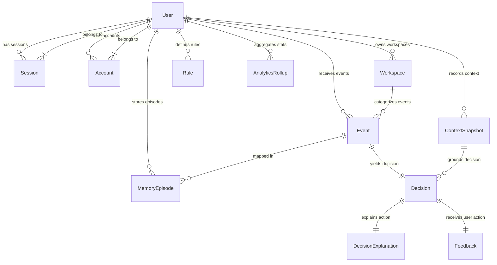

# InterruptIQ: Database Architecture & Design Specification

This document provides the ER Diagram, model explanation, indexing design, migration plan, and seeding strategy for the relational database schema defined in `apps/api/prisma/schema.prisma`.

---

## 1. Entity Relationship (ER) Diagram



---

## 2. Table Explanations

### 2.1 Authentication Tables
* **`User`**: The central actor. Core identity table holding account creation timestamps and soft delete flags.
* **`Session`**: Tracks active web dashboard logins (Better Auth compatible).
* **`Account`**: Stores credentials (hashed passwords) and OAuth provider scopes (Google Calendar, Slack integrations).
* **`Verification`**: Handles email verification tokens and expiration loops.

### 2.2 Core Domain Tables
* **`Workspace`**: A logical boundary separating environments (e.g. "Work", "Personal").
* **`ContextSnapshot`**: Captures active workspace signals (battery status, active window activity, online network state).
* **`Event`**: Stores normalized incoming notifications (Slack messages, GitHub assignments).
* **`Decision`**: Stores computed outputs from the AI/Heuristic engine (`IGNORE`, `DELAY`, `NOTIFY NOW`) paired with the confidence score.
* **`DecisionExplanation`**: Deep-dive attribution record showing how rules, vector similarity, and LLM histories weighed into the decision.
* **`Feedback`**: Logs user manual overrides (e.g. clicking "Read now" on a delayed alert) for model alignment.
* **`Rule`**: Custom user-defined heuristic rule payloads serialized as JSON.
* **`MemoryEpisode`**: Maps specific notification events to dense vector identifiers stored inside Qdrant.
* **`AnalyticsRollup`**: Aggregated timeseries table storing daily performance indicators.

---

## 3. Relationship Logic & Cascades

* **User Dependencies (`onDelete: Cascade`):** If a user deletes their account, all sessions, context pings, rule overrides, workspaces, and historic events are deleted to comply with GDPR privacy laws.
* **Loose Context Association (`onDelete: SetNull`):** If a `ContextSnapshot` or `Workspace` is deleted, related `Decisions` and `Events` are NOT deleted. Instead, foreign keys are set to `null` to preserve historic decision histories.
* **Tight Event Correlation (`onDelete: Cascade`):** A `Decision` cannot exist without an `Event`. If an event is deleted, its decision, explanation, and user override records are cascaded.

---

## 4. Indexing Strategy

To keep decision pipelines fast and keep dashboard loads snappy, we define key indexes:
* `User(email)`: Speeds up credentials and Session lookup.
* `ContextSnapshot(userId, createdAt)`: Quickly gathers the most recent workspace signal for incoming notifications.
* `Event(userId, createdAt)`: Rapidly compiles the daily activity ledger.
* `Rule(userId, isActive)`: Allows the Fast Heuristic Engine to query active filters in <1ms.
* `AnalyticsRollup(userId, date)`: Fast dashboard metric loading.

---

## 5. Migration Strategy

1. **Local Setup:** Load environment variables and start database container:
   ```bash
   pnpm --filter "@interrupt-iq/api" prisma migrate dev --name init
   ```
2. **Production Deployments:** Run compiled migration SQL scripts without dev dependencies:
   ```bash
   pnpm --filter "@interrupt-iq/api" prisma migrate deploy
   ```

---

## 6. Seeding Strategy

The seed script creates a clean testing workspace containing:
1. One default developer user account.
2. Standard workspace tags ("Work", "Personal").
3. A set of default heuristic rules (e.g. battery preservation filters).
4. Simulated context records (e.g. "coding" state) and test notification entries.

To seed the database, run:
```bash
pnpm --filter "@interrupt-iq/api" prisma db seed
```
